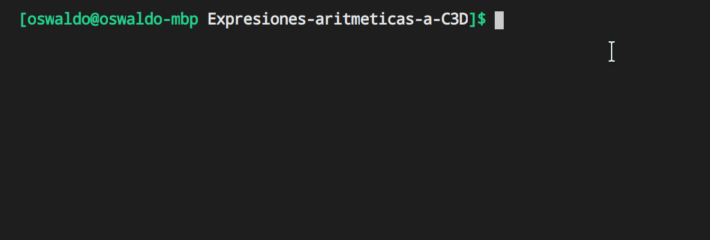
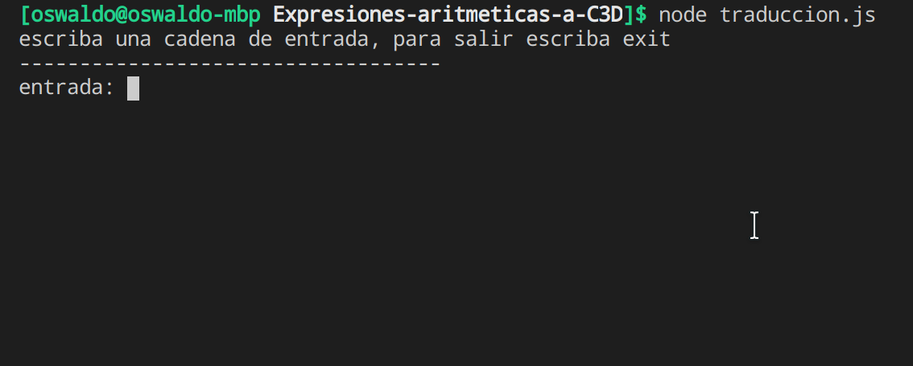
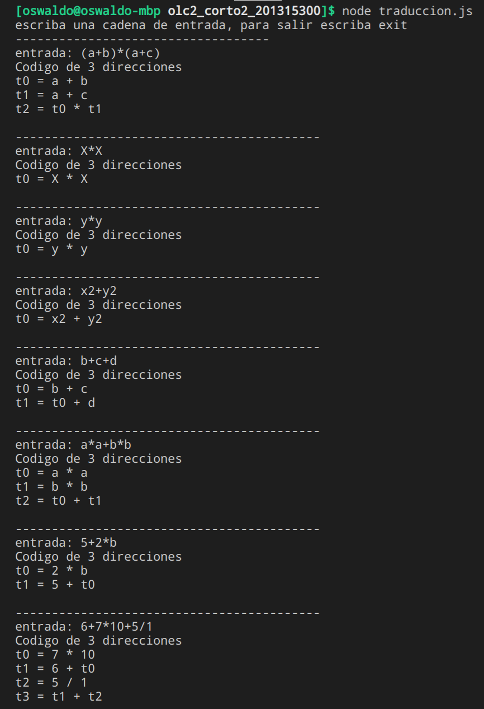
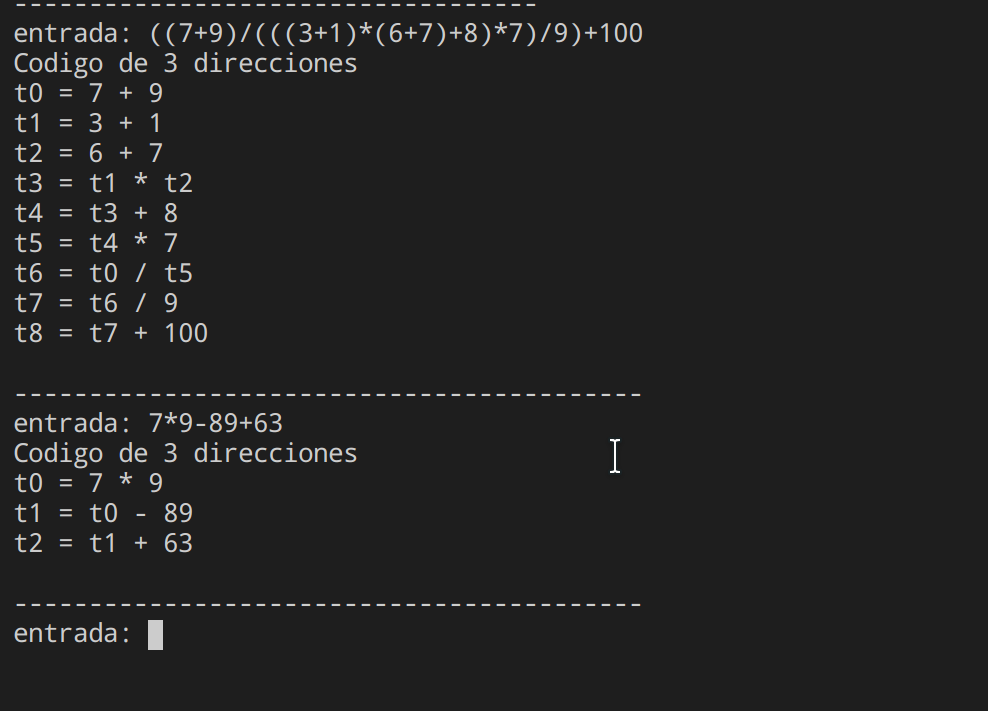

## Expresiones aritmeticas a C3D utilizando jison
### Walter Oswaldo Mach Velasquez
### 201315300

## Requisitos previos
* ### instalar Nodejs 

## Ejecucion del  proyecto 
* ### Descargar el  proyecto
* ### iniciar terminal  en la carpeta del proyecto

{ width=300 }

* ### ejecutar el archivo traduccion.js utilizando nodejs escribiendo el comando node "traduccion.js" en la terminal abierta

{ width=300 }
* ### Escribir una expresion aritmetica  para su traduccion a codigo de 3 direcciones

### Ejemplos de ejecucion a traves de varias cadenas de varias cadenas de entrada

{ width=500 }

{ width=500 }

